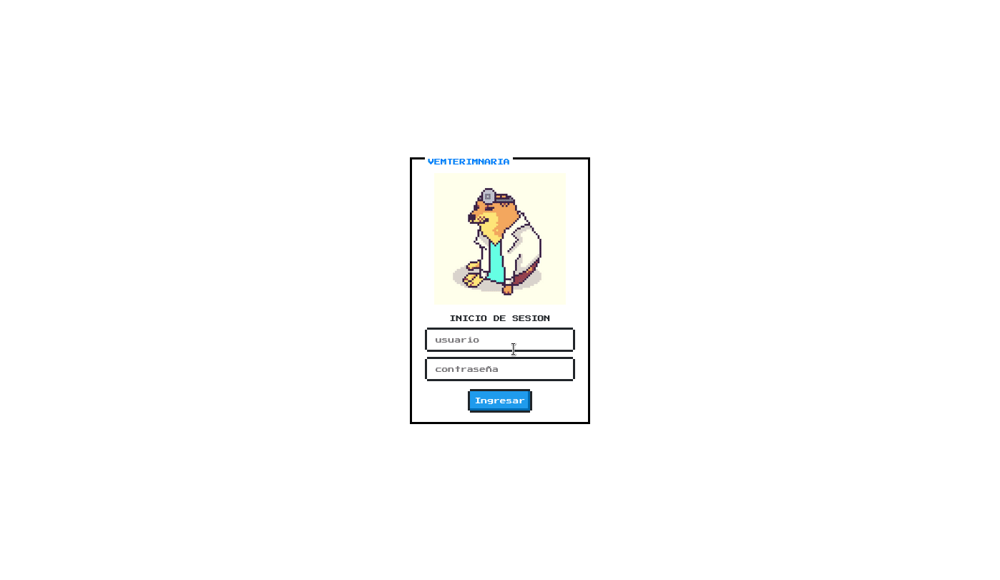
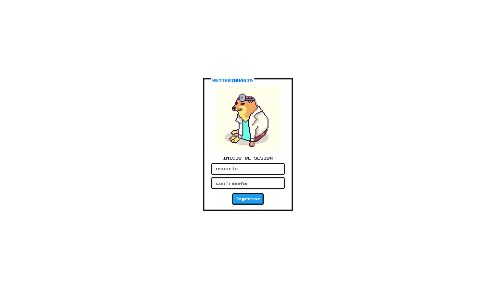
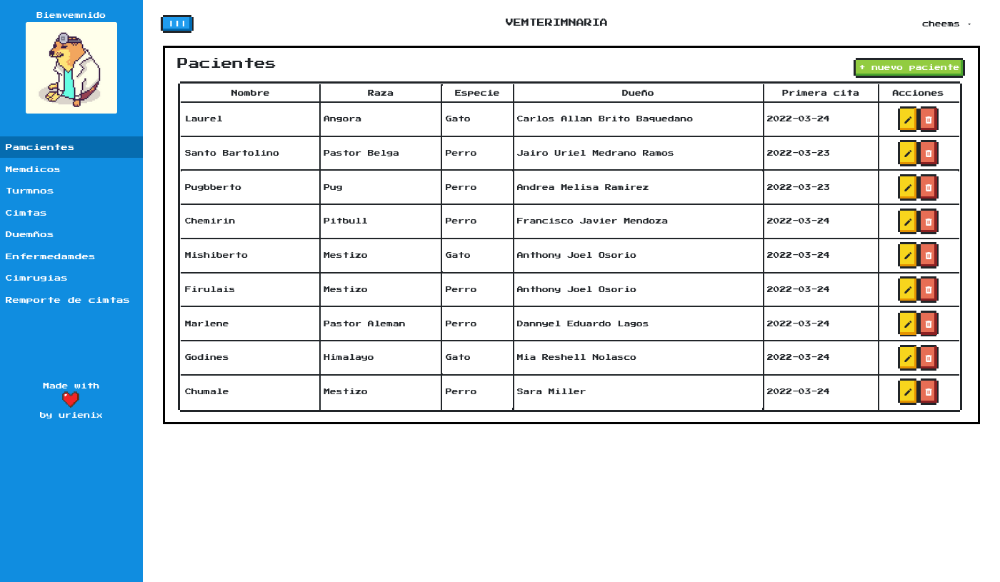
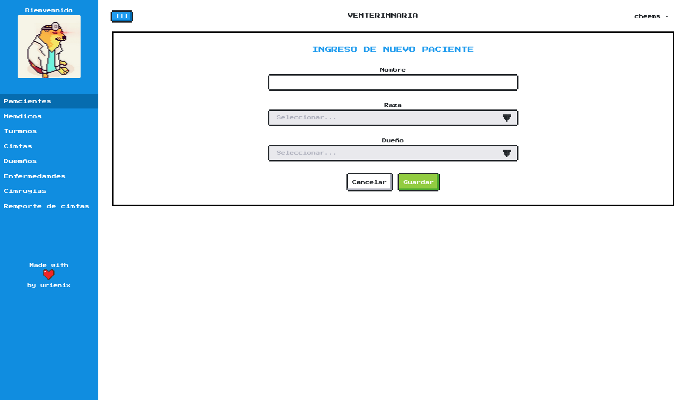
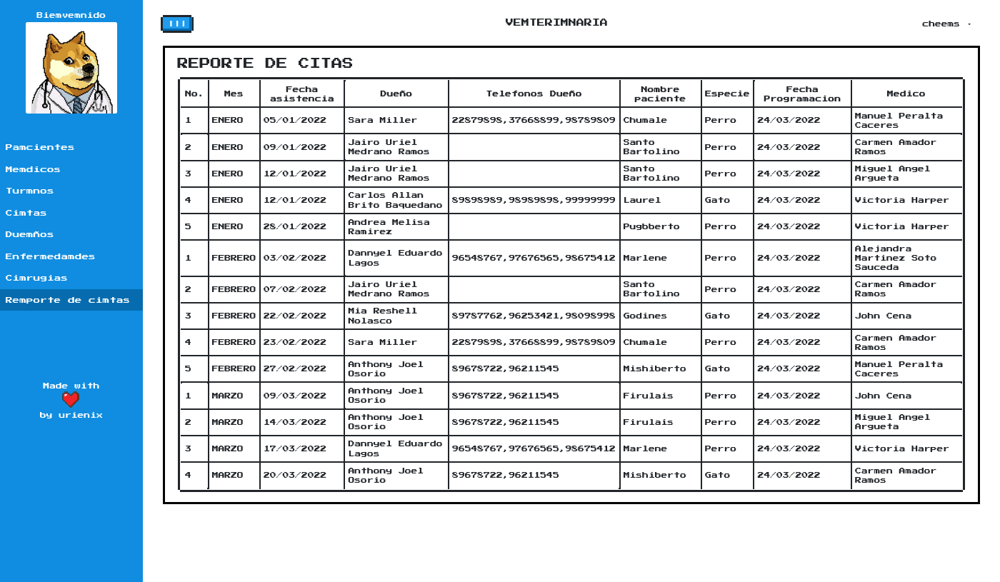

# Promyecto vemterimnaria

Este es un proyecto desarrollado con fines de aprendizaje para la clase de Administración de bases de datos (Q1 2022), donde basicamente se crearon scripts SQL, una aplicacion en nodejs (v17.1) entre otras cosas.

### Video explicativo
Puedes ver los detalles del proyecto explicados [aquí](https://youtu.be/cl3N-gyy39U)
### Tecnologías utilizadas
- [NodeJS](https://nodejs.org/es) v17.1
- [Pauquete de Node OracleDB](https://www.npmjs.com/package/oracledb)
- [Bootstrap](https://getbootstrap.com/docs/4.1) v4.1
- [NES.css](https://nostalgic-css.github.io/NES.css)
### Capturas de pantalla

Hecho con 💙 por <a href="https://urienix.moe">urienix</a>

